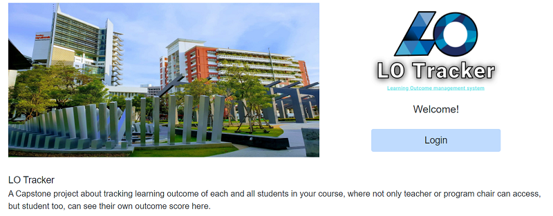

# LO Tracker
This project was generated using [Nx](https://nx.dev).  
Tech stack: Next.js, Go, GraphQL, Prisma (PostgreSQL), Redis (JWT)

## Project Background
a Computer Science project about educational management

## Team members
- 61130500208 Nuttawut Promsuk [GitHub](https://github.com/Nuttawut503) [LinkedIn](https://www.linkedin.com/in/nuttawut-promsuk)
- 61130500239 Napat Jamjan [GitHub](https://github.com/NapatJamjan) [LinkedIn](https://www.linkedin.com/in/napat-jamjan)
- 61130500255 Chirayu Phromchan [GitHub](https://github.com/sirchirayu2400) [LinkedIn](https://www.linkedin.com/in/chirayu-phromchan)
